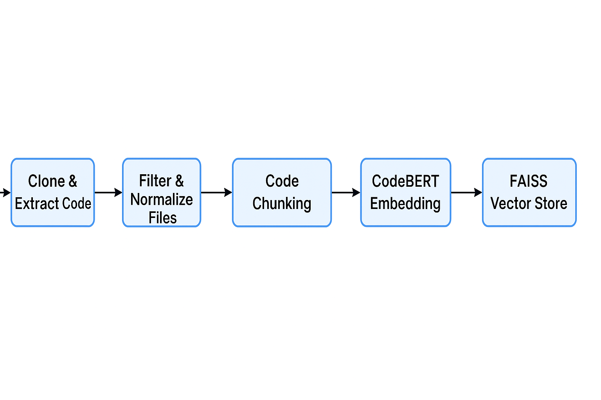

# Repository Processing Microservice

This microservice clones GitHub repositories, processes code files, generates embeddings, and stores them in a vector database for code similarity search.

## 🚀 What It Does

The Repository Processing Microservice is designed to:

1. Clone GitHub repositories
2. Extract and filter code files
3. Process code by normalizing, removing comments, and standardizing formatting
4. Generate embeddings using CodeBERT
5. Store embeddings in a FAISS vector database
6. Provide APIs for searching similar code chunks

## 🔁 Pipeline Overview
---



## 🧩 Key Features

- **Repository Cloning**: Clones repositories from GitHub URLs
- **Code File Processing**: Extracts code files and filters by extensions
- **Code Normalization**: Removes comments, whitespace, and standardizes format
- **Embedding Generation**: Uses CodeBERT to create embeddings for code chunks
- **Vector Storage**: Stores embeddings in FAISS for efficient similarity search
- **Background Processing**: Handles long-running tasks in the background
- **Progress Tracking**: Monitors and reports processing status


## 📡 API Endpoints

| Method | Endpoint             | Description                          |
|--------|----------------------|--------------------------------------|
| GET    | `/`                  | Health check                         |
| POST   | `/clone-and-process` | Clone & process repositories         |
| POST   | `/get-embedding`     | Generate embedding from code         |
| POST   | `/search-similar`    | Search similar code by embedding     |
| POST   | `/cleanup`           | Clean cloned data / clear vector DB  |
| GET    | `/progress`          | Track progress of background tasks   |

---

## Installation

### Prerequisites
- Python 3.8+
- Git
- libmagic (for file type detection)
- CUDA-compatible GPU (optional, for faster embedding generation)

### Setup

1. Clone this repository:
   ```bash
   git clone https://github.com/yourusername/repository-processing-microservice.git
   cd repository-processing-microservice
   ```

2. Create a virtual environment:
   ```bash
   python -m venv venv
   source venv/bin/activate  # On Windows: venv\Scripts\activate
   ```

3. Install dependencies:
   ```bash
   pip install -r requirements.txt
   ```

4. Create a `.env` file with configuration:
   ```
   GITHUB_REPOSITORIES=https://github.com/username/repo1,https://github.com/username/repo2
   EMBEDDING_MODEL=microsoft/codebert-base
   MAX_TOKENS_PER_CHUNK=510
   CHUNK_OVERLAP=100
   ```

## Usage

### Starting the Service

```bash
uvicorn app.main:app --reload
```

The service will be available at http://localhost:8000.

### Processing Repositories

1. Set repository URLs in the `.env` file or use the API endpoint
2. Send a POST request to `/clone-and-process`
3. Monitor progress via the `/progress` endpoint
4. Once complete, use `/search-similar` to find similar code chunks

### Example Flow

1. Clone and process repositories:
   ```bash
   curl -X POST -H "Content-Type: application/json" -d '{"repo_urls": ["https://github.com/username/repo1"]}' http://localhost:8000/clone-and-process
   ```

2. Check progress:
   ```bash
   curl http://localhost:8000/progress
   ```

3. Search for similar code (after processing is complete):
   ```bash
   curl -X POST -H "Content-Type: application/json" -d '{"embedding": [...], "top_k": 5}' http://localhost:8000/search-similar
   ```

## Code Processing Pipeline

1. **Repository Cloning**
   - Repositories are cloned from GitHub URLs
   - Hidden directories like `.git` are skipped

2. **Code File Filtering**
   - Files are filtered by extension (e.g., `.py`, `.js`, `.java`)
   - Binary files are excluded
   - Files larger than 1MB are skipped

3. **Code Normalization**
   - Comments are removed
   - Indentation is standardized
   - Code is converted to lowercase
   - Whitespace is normalized

4. **Chunking**
   - Code is split into chunks of around 510 tokens
   - Chunks have an overlap of 100 tokens for context

5. **Embedding Generation**
   - CodeBERT model is used to generate embeddings
   - CLS token is used as the code representation
   - Embeddings are normalized for similarity search

6. **Vector Storage**
   - Embeddings are stored in a FAISS vector store
   - Metadata and original code chunks are preserved

## Environment Variables

| Variable              | Description                             | Default Value          |
|-----------------------|-----------------------------------------|------------------------|
| GITHUB_REPOSITORIES   | Comma-separated list of GitHub URLs     | None                   |
| EMBEDDING_MODEL       | Hugging Face model name for CodeBERT    | microsoft/codebert-base|
| MAX_TOKENS_PER_CHUNK  | Maximum tokens per code chunk           | 510                    |
| CHUNK_OVERLAP         | Token overlap between chunks            | 100                    |

## Directory Structure

```
.
├── LICENSE                  # License
├── app/
│   ├── __init__.py
│   ├── background_tasks.py  # Background processing logic
│   ├── cleanup.py           # Repository cleanup utilities
│   ├── clone_and_process.py # GitHub repo cloning and processing
│   ├── codebert_embedder.py # Code embedding generation
│   ├── main.py              # FastAPI application and endpoints
│   ├── utils.py             # Utility functions
│   └── vector_store.py      # FAISS vector store wrapper
├── repositories/            # Directory for cloned repository files
├── vector_store/            # Directory for vector store data
├── Dockerfile               # Docker to compose
├── docker-compose.yml       # composes docker
├── requirements.txt         # Python dependencies
└── README.md                # This documentation
```

## Dependencies

- FastAPI: Web framework
- Git: Repository cloning
- Transformers: CodeBERT model
- FAISS: Vector similarity search
- TikToken: Token counting
- Python-magic: File type detection

## Limitations

- Maximum file size: 1MB
- Binary files are excluded
- Only specific code file extensions are processed

## Contributions

Contributions are welcome! Please feel free to submit a Pull Request.


## 🐳 Docker Setup

You can run this microservice easily using Docker Compose.

### 1. Create `.env` file (if not already created)

```env
GITHUB_REPOSITORIES=https://github.com/username/repo1
EMBEDDING_MODEL=microsoft/codebert-base
MAX_TOKENS_PER_CHUNK=510
CHUNK_OVERLAP=100
```

### 2. `docker-compose.yml`

```yaml
version: '3.9'

services:
  clone_and_process:
    build:
      context: .
      dockerfile: Dockerfile
    ports:
      - "8000:8000"
    volumes:
      - .:/app
    env_file:
      - .env
    command: uvicorn app.main:app --host 0.0.0.0 --port 8000 --reload
```

### 3. `Dockerfile`

```dockerfile
FROM python:3.10-slim

WORKDIR /app

COPY requirements.txt .

RUN apt-get update && apt-get install -y --no-install-recommends \
    git \
    libmagic1 \
    build-essential \
    && apt-get clean && rm -rf /var/lib/apt/lists/*

RUN pip install --no-cache-dir -r requirements.txt python-dotenv

RUN mkdir -p /app/repositories /app/vector_store

COPY . .

CMD ["uvicorn", "app.main:app", "--host", "0.0.0.0", "--port", "8000"]
```

### 4. Run the Microservice

```bash
docker-compose up --build
```

Access it at: [http://localhost:8000](http://localhost:8000)


## License

[MIT License](LICENSE)